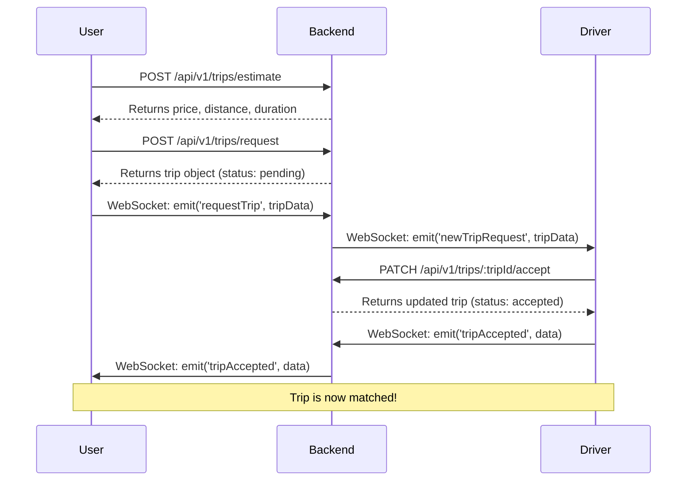
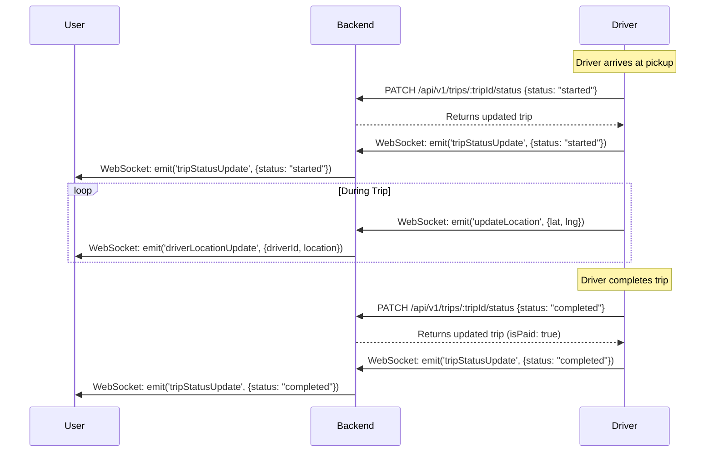
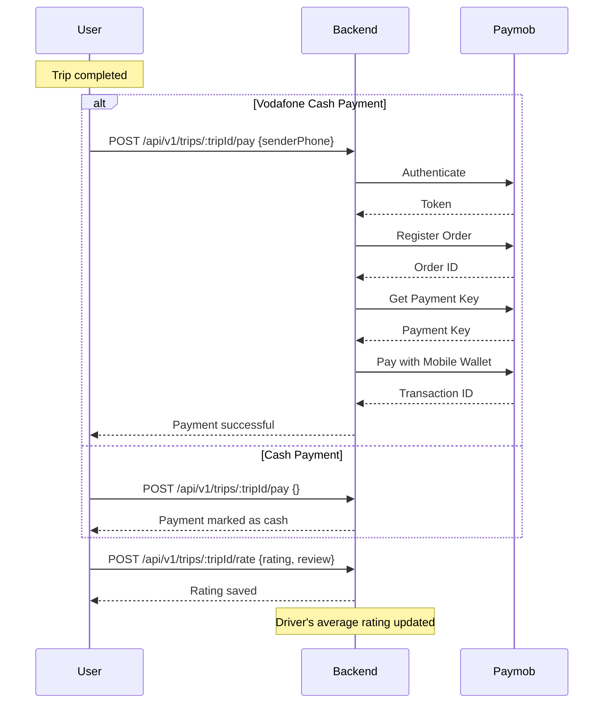
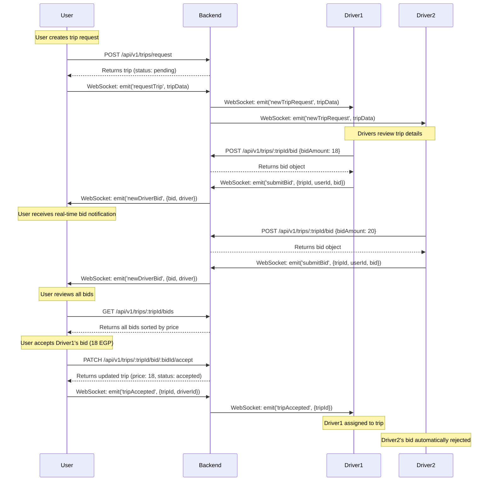
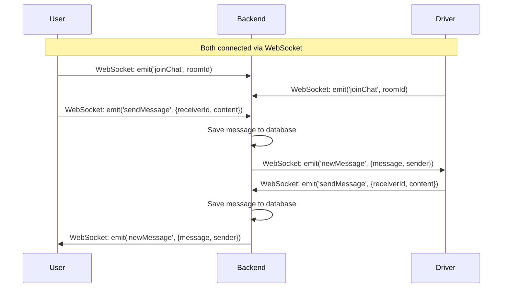

# Taxi App Backend API Documentation

Complete API reference for the taxi application backend including REST endpoints, WebSocket events, and integration flow.

---

## Table of Contents
- [Authentication](#authentication)
- [Trip Management](#trip-management)
- [Driver Bidding System](#driver-bidding-system)
- [WebSocket Connection](#websocket-connection)
- [WebSocket Events](#websocket-events)
- [Chat System](#chat-system)
- [Complete Flow Examples](#complete-flow-examples)

---

## Base URL
```
http://localhost:3000/api/v1
```

---

## Authentication

All authentication endpoints are under `/api/v1/auth`

### 1. Sign Up (User or Driver)

**Endpoint**: `POST /api/v1/auth/signup`

**Description**: Register a new user or driver account

**Request Body**:
```json
{
  "name": "John Doe",
  "email": "john@example.com",
  "password": "password123",
  "role": "user",  // "user" or "driver"
  "location": {    // Optional
    "lat": 30.0444,
    "lng": 31.2357
  }
}
```

**For Driver Signup** (include carType):
```json
{
  "name": "Ahmed Driver",
  "email": "ahmed@example.com",
  "password": "driver123",
  "role": "driver",
  "carType": "car",  // "scooter", "car", or "high_class"
  "location": {
    "lat": 30.0444,
    "lng": 31.2357
  }
}
```

**Response** (201 Created):
```json
{
  "message": "success",
  "token": "eyJhbGciOiJIUzI1NiIsInR5cCI6IkpXVCJ9...",
  "user": {
    "id": "507f1f77bcf86cd799439011",
    "name": "John Doe",
    "email": "john@example.com",
    "role": "user"
  }
}
```

---

### 2. Sign In (Login)

**Endpoint**: `POST /api/v1/auth/signin`

**Description**: Login for both users and drivers

**Request Body**:
```json
{
  "email": "john@example.com",
  "password": "password123"
}
```

**Response** (200 OK):
```json
{
  "message": "success",
  "token": "eyJhbGciOiJIUzI1NiIsInR5cCI6IkpXVCJ9...",
  "user": {
    "id": "507f1f77bcf86cd799439011",
    "name": "John Doe",
    "email": "john@example.com",
    "role": "user"
  }
}
```

**Authentication Header** (for protected routes):
```
Authorization: Bearer <your-token-here>
```

---

## Trip Management

All trip endpoints require authentication. Include the JWT token in the Authorization header.

Base path: `/api/v1/trips`

---

### 1. Get Trip Estimate

**Endpoint**: `POST /api/v1/trips/estimate`

**Description**: Calculate price, distance, and duration for a trip

**Headers**:
```
Authorization: Bearer <token>
```

**Request Body**:
```json
{
  "pickup": {
    "lat": 30.0444,
    "lng": 31.2357
  },
  "dropoff": {
    "lat": 30.0626,
    "lng": 31.2497
  },
  "carType": "car"  // "scooter", "car", or "high_class"
}
```

**Response** (200 OK):
```json
{
  "message": "success",
  "estimate": {
    "distance": "2.45",      // km
    "duration": 5,           // minutes
    "price": 20,             // EGP
    "carType": "car"
  }
}
```

**Pricing Rates**:
- **Scooter**: Base 5 EGP + 2 EGP/km + 0.5 EGP/min
- **Car**: Base 10 EGP + 4 EGP/km + 1 EGP/min
- **High Class**: Base 20 EGP + 8 EGP/km + 2 EGP/min

---

### 2. Request Trip

**Endpoint**: `POST /api/v1/trips/request`

**Description**: Create a new trip request (User only)

**Headers**:
```
Authorization: Bearer <token>
```

**Request Body**:
```json
{
  "pickup": {
    "lat": 30.0444,
    "lng": 31.2357,
    "address": "Downtown Cairo"
  },
  "dropoff": {
    "lat": 30.0626,
    "lng": 31.2497,
    "address": "Zamalek"
  },
  "carType": "car",
  "price": 20,
  "distance": 2.45,
  "duration": 5,
  "paymentMethod": "cash"  // "cash" or "vodafone_cash"
}
```

**Response** (201 Created):
```json
{
  "message": "success",
  "trip": {
    "_id": "65f1a2b3c4d5e6f7g8h9i0j1",
    "userId": "507f1f77bcf86cd799439011",
    "pickup": {
      "lat": 30.0444,
      "lng": 31.2357,
      "address": "Downtown Cairo"
    },
    "dropoff": {
      "lat": 30.0626,
      "lng": 31.2497,
      "address": "Zamalek"
    },
    "carType": "car",
    "status": "pending",
    "price": 20,
    "distance": 2.45,
    "duration": 5,
    "paymentMethod": "cash",
    "isPaid": false,
    "createdAt": "2025-11-25T12:00:00.000Z"
  }
}
```

> **Next Step**: After creating the trip, emit `requestTrip` via WebSocket to notify nearby drivers

---

### 3. Accept Trip

**Endpoint**: `PATCH /api/v1/trips/:tripId/accept`

**Description**: Driver accepts a trip request

**Headers**:
```
Authorization: Bearer <driver-token>
```

**Response** (200 OK):
```json
{
  "message": "success",
  "trip": {
    "_id": "65f1a2b3c4d5e6f7g8h9i0j1",
    "userId": "507f1f77bcf86cd799439011",
    "driverId": "607f1f77bcf86cd799439022",
    "status": "accepted",
    "carType": "car",
    "price": 20
  }
}
```

> **Next Step**: Emit `tripAccepted` via WebSocket to notify the user

---

### 4. Update Trip Status

**Endpoint**: `PATCH /api/v1/trips/:tripId/status`

**Description**: Update trip status (Driver only)

**Headers**:
```
Authorization: Bearer <driver-token>
```

**Request Body**:
```json
{
  "status": "started"  // "started", "completed", or "cancelled"
}
```

**Response** (200 OK):
```json
{
  "message": "success",
  "trip": {
    "_id": "65f1a2b3c4d5e6f7g8h9i0j1",
    "status": "started",
    "isPaid": false
  }
}
```

**Status Flow**:
1. `pending` → Driver sees request
2. `accepted` → Driver accepts trip
3. `started` → Driver starts the trip
4. `completed` → Trip finished
5. `cancelled` → Trip cancelled

> **Note**: When status is updated to `completed`, `isPaid` is automatically set to `true`

---

### 5. Pay for Trip

**Endpoint**: `POST /api/v1/trips/:tripId/pay`

**Description**: Process payment for a trip (supports Vodafone Cash via Paymob)

**Headers**:
```
Authorization: Bearer <user-token>
```

**Request Body** (for Vodafone Cash):
```json
{
  "paymentDetails": {
    "senderPhone": "01012345678"
  }
}
```

**Request Body** (for Cash):
```json
{}
```

**Response** (200 OK):
```json
{
  "message": "success",
  "trip": {
    "_id": "65f1a2b3c4d5e6f7g8h9i0j1",
    "isPaid": true,
    "paymentMethod": "vodafone_cash",
    "paymentDetails": {
      "senderPhone": "01012345678",
      "paymobOrderId": "123456",
      "paymobTransactionId": "789012"
    }
  }
}
```

---

### 6. Rate Driver

**Endpoint**: `POST /api/v1/trips/:tripId/rate`

**Description**: User rates the driver after trip completion

**Headers**:
```
Authorization: Bearer <user-token>
```

**Request Body**:
```json
{
  "rating": 5,  // 1-5
  "review": "Excellent driver, very professional!"
}
```

**Response** (200 OK):
```json
{
  "message": "success"
}
```

> **Note**: This automatically updates the driver's average rating

---

## Driver Bidding System

The bidding system allows drivers to submit custom price offers for trip requests. Users can review all bids and choose the best option.

### 7. Submit Bid (Driver)

**Endpoint**: `POST /api/v1/trips/:tripId/bid`

**Description**: Driver submits a custom price bid for a trip request

**Headers**:
```
Authorization: Bearer <driver-token>
```

**Request Body**:
```json
{
  "bidAmount": 25,
  "message": "I can pick you up in 2 minutes!"  // Optional
}
```

**Response** (201 Created):
```json
{
  "message": "success",
  "bid": {
    "_id": "65f2b3c4d5e6f7g8h9i0j1k2",
    "tripId": "65f1a2b3c4d5e6f7g8h9i0j1",
    "driverId": {
      "_id": "607f1f77bcf86cd799439022",
      "name": "Ahmed Driver",
      "averageRating": 4.8,
      "carType": "car"
    },
    "bidAmount": 25,
    "message": "I can pick you up in 2 minutes!",
    "status": "pending",
    "createdAt": "2025-11-25T12:05:00.000Z"
  }
}
```

**Validation Rules**:
- Only drivers can submit bids
- Trip must be in `pending` status
- Driver can only submit one bid per trip
- Bid amount must be greater than 0

> **Next Step**: After submitting via REST API, emit `submitBid` via WebSocket to notify the user in real-time

---

### 8. Get Trip Bids (User)

**Endpoint**: `GET /api/v1/trips/:tripId/bids`

**Description**: User retrieves all pending bids for their trip request

**Headers**:
```
Authorization: Bearer <user-token>
```

**Response** (200 OK):
```json
{
  "message": "success",
  "count": 3,
  "bids": [
    {
      "_id": "65f2b3c4d5e6f7g8h9i0j1k2",
      "tripId": "65f1a2b3c4d5e6f7g8h9i0j1",
      "driverId": {
        "_id": "607f1f77bcf86cd799439022",
        "name": "Ahmed Driver",
        "email": "ahmed@example.com",
        "averageRating": 4.8,
        "ratingCount": 120,
        "carType": "car",
        "location": {
          "lat": 30.0450,
          "lng": 31.2360
        }
      },
      "bidAmount": 18,
      "message": "I'm very close to you!",
      "status": "pending",
      "createdAt": "2025-11-25T12:05:00.000Z"
    },
    {
      "_id": "65f2b3c4d5e6f7g8h9i0j1k3",
      "tripId": "65f1a2b3c4d5e6f7g8h9i0j1",
      "driverId": {
        "_id": "607f1f77bcf86cd799439023",
        "name": "Mohamed Driver",
        "email": "mohamed@example.com",
        "averageRating": 4.9,
        "ratingCount": 200,
        "carType": "car",
        "location": {
          "lat": 30.0460,
          "lng": 31.2370
        }
      },
      "bidAmount": 20,
      "message": "",
      "status": "pending",
      "createdAt": "2025-11-25T12:06:00.000Z"
    },
    {
      "_id": "65f2b3c4d5e6f7g8h9i0j1k4",
      "tripId": "65f1a2b3c4d5e6f7g8h9i0j1",
      "driverId": {
        "_id": "607f1f77bcf86cd799439024",
        "name": "Ali Driver",
        "email": "ali@example.com",
        "averageRating": 4.7,
        "ratingCount": 85,
        "carType": "car",
        "location": {
          "lat": 30.0440,
          "lng": 31.2350
        }
      },
      "bidAmount": 22,
      "message": "Professional service guaranteed!",
      "status": "pending",
      "createdAt": "2025-11-25T12:07:00.000Z"
    }
  ]
}
```

**Notes**:
- Bids are sorted by price (lowest first)
- Only shows `pending` bids
- Includes driver details for user to make informed decision
- User can only view bids for their own trips

---

### 9. Accept Bid (User)

**Endpoint**: `PATCH /api/v1/trips/:tripId/bid/:bidId/accept`

**Description**: User accepts a specific bid and assigns the driver to the trip

**Headers**:
```
Authorization: Bearer <user-token>
```

**Response** (200 OK):
```json
{
  "message": "success",
  "trip": {
    "_id": "65f1a2b3c4d5e6f7g8h9i0j1",
    "userId": "507f1f77bcf86cd799439011",
    "driverId": "607f1f77bcf86cd799439022",
    "status": "accepted",
    "price": 18,  // Updated to bid amount
    "carType": "car",
    "pickup": {
      "lat": 30.0444,
      "lng": 31.2357,
      "address": "Downtown Cairo"
    },
    "dropoff": {
      "lat": 30.0626,
      "lng": 31.2497,
      "address": "Zamalek"
    }
  }
}
```

**What Happens**:
1. Trip is assigned to the driver who submitted the bid
2. Trip price is updated to the bid amount
3. Trip status changes to `accepted`
4. The accepted bid status changes to `accepted`
5. All other pending bids for this trip are automatically rejected

> **Next Step**: Emit `tripAccepted` via WebSocket to notify the driver

---


## WebSocket Connection

### Connection Setup

**URL**: `ws://localhost:3000` or `wss://your-domain.com`

**Authentication**: Pass JWT token during connection

**Client-side Example** (JavaScript):
```javascript
import { io } from 'socket.io-client';

const socket = io('http://localhost:3000', {
  auth: {
    token: 'your-jwt-token-here'
  }
});

socket.on('connect', () => {
  console.log('Connected to server');
});

socket.on('disconnect', () => {
  console.log('Disconnected from server');
});
```

**Flutter Example**:
```dart
import 'package:socket_io_client/socket_io_client.dart' as IO;

IO.Socket socket = IO.io('http://localhost:3000', <String, dynamic>{
  'transports': ['websocket'],
  'autoConnect': false,
  'auth': {
    'token': 'your-jwt-token-here'
  }
});

socket.connect();

socket.onConnect((_) {
  print('Connected to server');
});

socket.onDisconnect((_) {
  print('Disconnected from server');
});
```

---

## WebSocket Events

### Driver Events

#### 1. Update Location (Emit)

**Event**: `updateLocation`

**Description**: Driver sends location updates in real-time

**Emit Data**:
```javascript
socket.emit('updateLocation', {
  lat: 30.0444,
  lng: 31.2357
});
```

**Broadcast**: All connected users receive `driverLocationUpdate` event

---

#### 2. Driver Location Update (Listen)

**Event**: `driverLocationUpdate`

**Description**: Users receive real-time driver location updates

**Listen**:
```javascript
socket.on('driverLocationUpdate', (data) => {
  console.log('Driver location:', data);
  // data = { driverId: "607f...", location: { lat: 30.0444, lng: 31.2357 } }
});
```

---

### Trip Events

#### 1. Request Trip (Emit)

**Event**: `requestTrip`

**Description**: User emits this after creating a trip via REST API

**Emit Data**:
```javascript
socket.emit('requestTrip', {
  tripId: "65f1a2b3c4d5e6f7g8h9i0j1",
  pickup: {
    lat: 30.0444,
    lng: 31.2357,
    address: "Downtown Cairo"
  },
  dropoff: {
    lat: 30.0626,
    lng: 31.2497,
    address: "Zamalek"
  },
  carType: "car",
  price: 20,
  distance: 2.45,
  duration: 5
});
```

---

#### 2. New Trip Request (Listen)

**Event**: `newTripRequest`

**Description**: Drivers receive new trip requests

**Listen**:
```javascript
socket.on('newTripRequest', (data) => {
  console.log('New trip request:', data);
  // Show notification to driver
  // Driver can accept via REST API: PATCH /api/v1/trips/:tripId/accept
});
```

---

#### 3. Trip Accepted (Emit)

**Event**: `tripAccepted`

**Description**: Driver emits this after accepting a trip

**Emit Data**:
```javascript
socket.emit('tripAccepted', {
  tripId: "65f1a2b3c4d5e6f7g8h9i0j1",
  driverId: "607f1f77bcf86cd799439022",
  userId: "507f1f77bcf86cd799439011"  // socketId or userId
});
```

---

#### 4. Trip Accepted (Listen)

**Event**: `tripAccepted`

**Description**: User receives notification when driver accepts

**Listen**:
```javascript
socket.on('tripAccepted', (data) => {
  console.log('Trip accepted by driver:', data);
  // data = { tripId: "65f...", driverId: "607f..." }
  // Navigate to trip tracking screen
});
```

---

#### 5. Trip Status Update (Emit)

**Event**: `tripStatusUpdate`

**Description**: Driver emits status changes (started, completed, cancelled)

**Emit Data**:
```javascript
socket.emit('tripStatusUpdate', {
  tripId: "65f1a2b3c4d5e6f7g8h9i0j1",
  status: "started",  // "started", "completed", "cancelled"
  userId: "507f1f77bcf86cd799439011"
});
```

---

#### 6. Trip Status Update (Listen)

**Event**: `tripStatusUpdate`

**Description**: User receives trip status updates

**Listen**:
```javascript
socket.on('tripStatusUpdate', (data) => {
  console.log('Trip status updated:', data);
  // data = { tripId: "65f...", status: "started" }
  // Update UI accordingly
});
```

---

### Bidding Events

#### 1. Submit Bid (Emit)

**Event**: `submitBid`

**Description**: Driver emits this after submitting a bid via REST API to notify the user in real-time

**Emit Data**:
```javascript
socket.emit('submitBid', {
  tripId: "65f1a2b3c4d5e6f7g8h9i0j1",
  userId: "507f1f77bcf86cd799439011",  // User who requested the trip
  bid: {
    _id: "65f2b3c4d5e6f7g8h9i0j1k2",
    bidAmount: 18,
    message: "I'm very close to you!"
  }
});
```

---

#### 2. New Driver Bid (Listen)

**Event**: `newDriverBid`

**Description**: User receives real-time notifications when drivers submit bids

**Listen**:
```javascript
socket.on('newDriverBid', (data) => {
  console.log('New bid received:', data);
  // data = {
  //   tripId: "65f1a2b3c4d5e6f7g8h9i0j1",
  //   bid: {
  //     _id: "65f2b3c4d5e6f7g8h9i0j1k2",
  //     bidAmount: 18,
  //     message: "I'm very close to you!"
  //   },
  //   driver: {
  //     id: "607f1f77bcf86cd799439022",
  //     name: "Ahmed Driver",
  //     rating: 4.8,
  //     ratingCount: 120,
  //     carType: "car",
  //     location: { lat: 30.0450, lng: 31.2360 }
  //   }
  // }
  
  // Display bid notification to user
  // Update bids list in UI
  // Show driver details and bid amount
});
```

**Data Includes**:
- Bid details (amount, message, ID)
- Driver information (name, rating, car type)
- Driver's current location
- Trip ID for reference

---

### Chat Events


#### 1. Join Chat Room (Emit)

**Event**: `joinChat`

**Description**: Join a chat room for communication

**Emit Data**:
```javascript
socket.emit('joinChat', 'room_tripId_65f1a2b3c4d5e6f7g8h9i0j1');
```

> **Note**: Users automatically join their own ID room on connection for private messages

---

#### 2. Send Message (Emit)

**Event**: `sendMessage`

**Description**: Send a message to another user (driver ↔ user)

**Emit Data**:
```javascript
socket.emit('sendMessage', {
  receiverId: "607f1f77bcf86cd799439022",  // Driver or User ID
  content: "I'm waiting at the main entrance"
});
```

**Database**: Message is automatically saved to the database

---

#### 3. New Message (Listen)

**Event**: `newMessage`

**Description**: Receive messages from other users

**Listen**:
```javascript
socket.on('newMessage', (data) => {
  console.log('New message:', data);
  // data = {
  //   message: { _id: "...", senderId: "...", receiverId: "...", content: "...", createdAt: "..." },
  //   sender: { id: "607f...", name: "Ahmed Driver" }
  // }
  // Display message in chat UI
});
```

---

## Complete Flow Examples

### Flow 1: User Requests a Trip



---

### Flow 2: Trip Execution



---

### Flow 3: Payment & Rating



---

---

### Flow 4: Driver Bidding System



---

### Flow 5: Real-time Chat




---

## Data Models

### User Model
```javascript
{
  _id: ObjectId,
  name: String,
  email: String,
  password: String (hashed),
  role: "user" | "driver",
  carType: "scooter" | "car" | "high_class",  // Driver only
  location: {
    lat: Number,
    lng: Number
  },
  isOnline: Boolean,
  socketId: String,
  averageRating: Number,
  ratingCount: Number,
  walletBalance: Number,
  createdAt: Date,
  updatedAt: Date
}
```

### Trip Model
```javascript
{
  _id: ObjectId,
  userId: ObjectId,
  driverId: ObjectId,
  pickup: {
    lat: Number,
    lng: Number,
    address: String
  },
  dropoff: {
    lat: Number,
    lng: Number,
    address: String
  },
  carType: "scooter" | "car" | "high_class",
  status: "pending" | "accepted" | "started" | "completed" | "cancelled",
  price: Number,
  distance: Number,  // km
  duration: Number,  // minutes
  paymentMethod: "cash" | "vodafone_cash",
  paymentDetails: {
    transactionId: String,
    senderPhone: String
  },
  isPaid: Boolean,
  rating: Number,  // 1-5
  review: String,
  createdAt: Date,
  updatedAt: Date
}
```

### Message Model
```javascript
{
  _id: ObjectId,
  senderId: ObjectId,
  receiverId: ObjectId,
  content: String,
  read: Boolean,
  createdAt: Date,
  updatedAt: Date
}
```

### Bid Model
```javascript
{
  _id: ObjectId,
  tripId: ObjectId,  // Reference to Trip
  driverId: ObjectId,  // Reference to User (driver)
  bidAmount: Number,  // Custom price offered by driver
  message: String,  // Optional message from driver (max 200 chars)
  status: "pending" | "accepted" | "rejected",
  createdAt: Date,
  updatedAt: Date
}
```

---

## Error Handling

All endpoints return errors in the following format:

```json
{
  "status": "fail",
  "message": "Error message here"
}
```

**Common HTTP Status Codes**:
- `200` - Success
- `201` - Created
- `400` - Bad Request (validation error)
- `401` - Unauthorized (authentication required)
- `404` - Not Found
- `500` - Internal Server Error

---

## Testing with cURL

### Sign Up as User
```bash
curl -X POST http://localhost:3000/api/v1/auth/signup \
  -H "Content-Type: application/json" \
  -d '{
    "name": "Test User",
    "email": "user@test.com",
    "password": "password123",
    "role": "user"
  }'
```

### Sign Up as Driver
```bash
curl -X POST http://localhost:3000/api/v1/auth/signup \
  -H "Content-Type: application/json" \
  -d '{
    "name": "Test Driver",
    "email": "driver@test.com",
    "password": "password123",
    "role": "driver",
    "carType": "car"
  }'
```

### Get Trip Estimate
```bash
curl -X POST http://localhost:3000/api/v1/trips/estimate \
  -H "Content-Type: application/json" \
  -H "Authorization: Bearer YOUR_TOKEN" \
  -d '{
    "pickup": {"lat": 30.0444, "lng": 31.2357},
    "dropoff": {"lat": 30.0626, "lng": 31.2497},
    "carType": "car"
  }'
```

### Request Trip
```bash
curl -X POST http://localhost:3000/api/v1/trips/request \
  -H "Content-Type: application/json" \
  -H "Authorization: Bearer YOUR_USER_TOKEN" \
  -d '{
    "pickup": {"lat": 30.0444, "lng": 31.2357, "address": "Downtown"},
    "dropoff": {"lat": 30.0626, "lng": 31.2497, "address": "Zamalek"},
    "carType": "car",
    "price": 20,
    "distance": 2.45,
    "duration": 5,
    "paymentMethod": "cash"
  }'
```

### Accept Trip (Driver)
```bash
curl -X PATCH http://localhost:3000/api/v1/trips/TRIP_ID/accept \
  -H "Authorization: Bearer YOUR_DRIVER_TOKEN"
```

---

## Mobile Integration Guide

### Flutter Example - Complete Flow

```dart
import 'package:socket_io_client/socket_io_client.dart' as IO;
import 'package:http/http.dart' as http;
import 'dart:convert';

class TaxiService {
  final String baseUrl = 'http://localhost:3000/api/v1';
  late IO.Socket socket;
  String? token;

  // Initialize WebSocket
  void connectSocket(String authToken) {
    token = authToken;
    socket = IO.io('http://localhost:3000', <String, dynamic>{
      'transports': ['websocket'],
      'autoConnect': false,
      'auth': {'token': authToken}
    });

    socket.connect();

    socket.onConnect((_) {
      print('Connected to server');
    });

    // Listen for trip requests (Driver)
    socket.on('newTripRequest', (data) {
      print('New trip request: $data');
      // Show notification to driver
    });

    // Listen for trip accepted (User)
    socket.on('tripAccepted', (data) {
      print('Trip accepted: $data');
      // Navigate to tracking screen
    });

    // Listen for driver location updates (User)
    socket.on('driverLocationUpdate', (data) {
      print('Driver location: $data');
      // Update map marker
    });

    // Listen for messages
    socket.on('newMessage', (data) {
      print('New message: $data');
      // Display in chat
    });
  }

  // Request a trip
  Future<Map<String, dynamic>> requestTrip(Map<String, dynamic> tripData) async {
    final response = await http.post(
      Uri.parse('$baseUrl/trips/request'),
      headers: {
        'Content-Type': 'application/json',
        'Authorization': 'Bearer $token',
      },
      body: jsonEncode(tripData),
    );

    if (response.statusCode == 201) {
      final trip = jsonDecode(response.body)['trip'];
      
      // Emit WebSocket event to notify drivers
      socket.emit('requestTrip', {
        'tripId': trip['_id'],
        'pickup': tripData['pickup'],
        'dropoff': tripData['dropoff'],
        'carType': tripData['carType'],
        'price': tripData['price'],
      });

      return trip;
    } else {
      throw Exception('Failed to request trip');
    }
  }

  // Update driver location
  void updateLocation(double lat, double lng) {
    socket.emit('updateLocation', {
      'lat': lat,
      'lng': lng,
    });
  }

  // Send message
  void sendMessage(String receiverId, String content) {
    socket.emit('sendMessage', {
      'receiverId': receiverId,
      'content': content,
    });
  }

  // ===== BIDDING SYSTEM =====

  // Submit a bid (Driver)
  Future<Map<String, dynamic>> submitBid(String tripId, double bidAmount, {String? message}) async {
    final response = await http.post(
      Uri.parse('$baseUrl/trips/$tripId/bid'),
      headers: {
        'Content-Type': 'application/json',
        'Authorization': 'Bearer $token',
      },
      body: jsonEncode({
        'bidAmount': bidAmount,
        if (message != null) 'message': message,
      }),
    );

    if (response.statusCode == 201) {
      final bid = jsonDecode(response.body)['bid'];
      
      // Emit WebSocket event to notify user in real-time
      socket.emit('submitBid', {
        'tripId': tripId,
        'userId': bid['tripId'], // You'll need to pass the userId
        'bid': {
          '_id': bid['_id'],
          'bidAmount': bid['bidAmount'],
          'message': bid['message'],
        }
      });

      return bid;
    } else {
      throw Exception('Failed to submit bid');
    }
  }

  // Get all bids for a trip (User)
  Future<List<dynamic>> getTripBids(String tripId) async {
    final response = await http.get(
      Uri.parse('$baseUrl/trips/$tripId/bids'),
      headers: {
        'Authorization': 'Bearer $token',
      },
    );

    if (response.statusCode == 200) {
      final data = jsonDecode(response.body);
      return data['bids'];
    } else {
      throw Exception('Failed to get bids');
    }
  }

  // Accept a bid (User)
  Future<Map<String, dynamic>> acceptBid(String tripId, String bidId) async {
    final response = await http.patch(
      Uri.parse('$baseUrl/trips/$tripId/bid/$bidId/accept'),
      headers: {
        'Authorization': 'Bearer $token',
      },
    );

    if (response.statusCode == 200) {
      final trip = jsonDecode(response.body)['trip'];
      
      // Emit WebSocket event to notify driver
      socket.emit('tripAccepted', {
        'tripId': tripId,
        'driverId': trip['driverId'],
      });

      return trip;
    } else {
      throw Exception('Failed to accept bid');
    }
  }

  // Listen for new bids (User) - Add this to connectSocket method
  void listenForBids(Function(Map<String, dynamic>) onNewBid) {
    socket.on('newDriverBid', (data) {
      print('New bid received: $data');
      onNewBid(data);
      // data contains: tripId, bid (amount, message), driver (name, rating, location, etc.)
    });
  }
}
```

**Usage Example - Driver Submits Bid**:
```dart
// Driver sees a trip request and submits a bid
try {
  final bid = await taxiService.submitBid(
    tripId: 'trip_id_here',
    bidAmount: 18.0,
    message: 'I can pick you up in 2 minutes!',
  );
  print('Bid submitted successfully: ${bid['bidAmount']} EGP');
} catch (e) {
  print('Error submitting bid: $e');
}
```

**Usage Example - User Views Bids**:
```dart
// User retrieves all bids for their trip
try {
  final bids = await taxiService.getTripBids('trip_id_here');
  
  // Display bids in UI, sorted by price (already sorted by backend)
  for (var bid in bids) {
    print('Driver: ${bid['driverId']['name']}');
    print('Rating: ${bid['driverId']['averageRating']}');
    print('Price: ${bid['bidAmount']} EGP');
    print('Message: ${bid['message']}');
    print('---');
  }
} catch (e) {
  print('Error getting bids: $e');
}
```

**Usage Example - User Accepts Bid**:
```dart
// User accepts a specific bid
try {
  final trip = await taxiService.acceptBid(
    tripId: 'trip_id_here',
    bidId: 'bid_id_here',
  );
  print('Bid accepted! Driver assigned: ${trip['driverId']}');
  print('Final price: ${trip['price']} EGP');
  // Navigate to trip tracking screen
} catch (e) {
  print('Error accepting bid: $e');
}
```

**Usage Example - User Listens for Real-time Bids**:
```dart
// In your UI initialization
taxiService.listenForBids((bidData) {
  // Show notification or update UI
  final driver = bidData['driver'];
  final bid = bidData['bid'];
  
  showNotification(
    title: 'New Bid from ${driver['name']}',
    message: '${bid['bidAmount']} EGP - ${bid['message']}',
  );
  
  // Update bids list in UI
  setState(() {
    currentBids.add(bidData);
  });
});


---

## Environment Variables

Create a `.env` file in your project root:

```env
PORT=3000
MONGODB_URI=mongodb://localhost:27017/taxi_app
JWT_SECRET=your-secret-key-here
PAYMOB_API_KEY=your-paymob-api-key
PAYMOB_INTEGRATION_ID=your-integration-id
```

---

## Notes

1. **Authentication**: All trip and WebSocket connections require a valid JWT token
2. **Real-time Updates**: Use WebSocket for real-time location tracking and notifications
3. **Payment**: Vodafone Cash payments are processed through Paymob integration
4. **Chat**: Messages are saved to database and delivered in real-time via WebSocket
5. **Driver Matching**: Currently broadcasts to all drivers; implement geolocation-based filtering for production
6. **Rate Limiting**: Consider implementing rate limiting for production use
7. **Error Handling**: Always handle WebSocket disconnections and reconnections gracefully

---

## Support

For issues or questions, please contact the development team.

**Last Updated**: November 25, 2025
